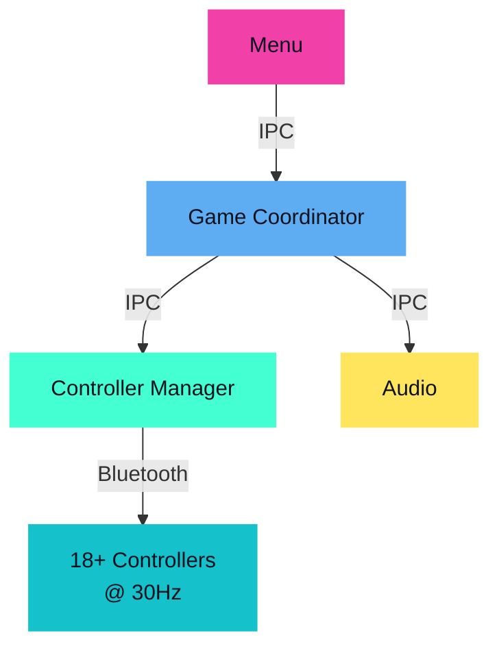
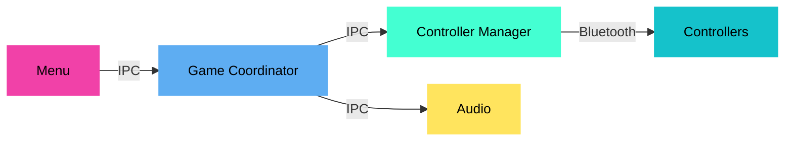
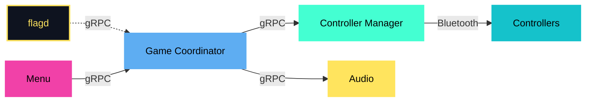
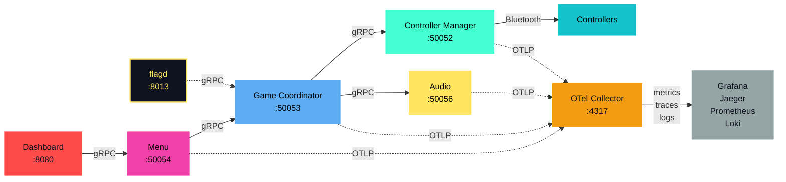

# 18 Bluetooth Controllers Walk Into a Bar
## Observability & Runtime Configuration with CNCF Tools

<div class="grid grid-cols-2 px-4 mx-auto mt-12 text-left">
<div class="flex items-center gap-2">
  
  <div class="leading-tight">
    <p class="!text-xl font-bold !mt-0 !mb-0">Simon Schrottner</p>
    <p class="!text-lg !mt-0 !mb-0">Senior Software Engineer, Dynatrace</p>
  </div>
</div>
<div class="flex items-center gap-2">
  
  <div class="leading-tight">
    <p class="!text-xl font-bold !mt-0 !mb-0">Manuel Timelthaler</p>
    <p class="!text-lg !mt-0 !mb-0">Software Architect, Tractive</p>
  </div>
</div>
</div>

<div class="abs-br m-6 flex gap-2">
  Cloud Native Linz, February 2026
</div>

<!--
Speaker Notes:
- Welcome everyone.
- Briefly introduce the title and the core idea: applying familiar CNCF tools to a weird, fun problem.
-->

---
layout: center
class: text-center
---

# What is JoustMania?

<div class="flex justify-center items-center my-8">
    
</div>

**A motion-controlled party game for up to 18+ PlayStation Move controllers**

Keep your controller still, jostle everyone else's.<br>
_No screens, just glowing controllers and chaos._

<!--
Speaker Notes (Manuel leads - 2:30):
- Brief intro to JoustMania
- "Motion-controlled party game"
- "2 to 18+ controllers - we've had up to 20 at conventions"
- "No screens, just glowing controllers and chaos"
- Sets up the technical challenge ahead
-->

---
layout: default
---

# Original Architecture (IPC-Based)

<div class="grid grid-cols-2">
<div>

**Before observability:**

- Process-based (multiprocessing)
- 30 Hz game loop (33ms frames)
- IPC via queues/shared memory
- 4 Python processes

**The problem:** OpenTelemetry needs network calls for context propagation

</div>
<div class="-mt-8">



</div>
</div>

<!--
Speaker Notes (Manuel - 2:30-5:00):
- "This is how JoustMania originally worked"
- "Process-based architecture with IPC"
- "No network calls, just local processes talking via pipes"
- "This sets up Learning 1 - we had to refactor this"
- "No error messages, just glowing controllers and chaos"
-->

---
layout: center
class: text-center
---

# What If We Actually Observed This Thing?

<div class="grid grid-cols-3 gap-x-16 gap-y-8 items-end justify-items-center my-12 px-12">
  <div class="flex flex-col items-center gap-2">
    
    <span class="text-sm text-gray-400">Telemetry Collection</span>
  </div>
  <div class="flex flex-col items-center gap-2">
    
    <span class="text-sm text-gray-400">Metrics Storage</span>
  </div>
  <div class="flex flex-col items-center gap-2">
    
    <span class="text-sm text-gray-400">Distributed Tracing</span>
  </div>
  <div class="flex flex-col items-center gap-2">
    
    <span class="text-sm text-gray-400">Visualization</span>
  </div>
  <div class="flex flex-col items-center gap-2">
    
    <span class="text-sm text-gray-400">Log Aggregation</span>
  </div>
  <div class="flex flex-col items-center gap-2">
    
    <span class="text-sm text-gray-400">Feature Flags</span>
  </div>
</div>

<div class="text-2xl mt-8 text-amber-300">
What could possibly go wrong?
</div>

<!--
Speaker Notes (Manuel - ~5:00):
- "I'm Manuel, by the way. Still don't work on hardware."
- "We wanted to see if CNCF observability tools could handle this"
- "OpenTelemetry, Prometheus, Grafana, Jaeger, OpenFeature"
- "What could possibly go wrong?"
- Transition: "We learned 6 things..."
-->

---
layout: section
class: text-center
---

# The Journey: 6 Learnings

What we discovered bringing CNCF tools to a real-time game

---
layout: default
---

# Learning 1: Had to Refactor to Microservices

**Problem:** IPC (pipes/queues) doesn't work with OpenTelemetry auto-instrumentation

<div class="grid grid-cols-3 gap-8 items-center mb-8">
<div>

### <span class="text-lg">Before</span><br>Process-Based IPC

</div>
<div class="col-span-2">



</div>
</div>

<div class="grid grid-cols-3 gap-8 items-center">
<div>

### <span class="text-lg">After</span><br>gRPC Microservices

</div>
<div class="col-span-2">



</div>
</div>

---
layout: default
---

# Learning 1: The Full Picture

**gRPC microservices enabled the observability stack**<br>
W3C trace context flows through calls, enabling distributed tracing



<!--
Speaker Notes (Simon - 5:00-6:30):
- "We figured we'd just add OTel and call it a day. Not even close."
- "IPC doesn't propagate trace context"
- "Had to refactor to gRPC microservices"
- "Once we did that, auto-instrumentation just worked"
-->

---
layout: default
---

# Learning 2: The Raspberry Pi Can Handle It

<iframe 
    src="http://himbeere.local/grafana/d/joustmania-host-metrics/joustmania-host-metrics-raspberry-pi?orgId=1&refresh=5s&kiosk" 
    width="100%" 
    height="400" 
    frameborder="0" 
    class="rounded-lg shadow-lg"></iframe>

<!--
Speaker Notes (Simon - 6:30-7:15):
- "The Pi didn't even break a sweat"
- Show dashboard with CPU, memory, temperature
- "Running OpenTelemetry Collector, Prometheus, Grafana, Jaeger"
- "All on a Raspberry Pi 4"
-->

---
layout: default
---

# Learning 2: Pi Performance

<div class="grid grid-cols-2 gap-12 my-8">
<div>

### Raspberry Pi 5 Specs
- Quad-core ARM Cortex-A76 @ 2.4GHz
- 8GB LPDDR4X RAM
- ~$80 USD

</div>
<div>

### Observed Performance
- CPU: ~45% under full load
- Memory: ~850 MB / 8 GB (10%)
- Temp: 65°C (with fan cooling)
- 18 controllers @ 60Hz

</div>
</div>

**The Pi runs both the game AND the full observability stack** — we didn't think this was possible initially, though you could also send telemetry to external services.

<!--
Speaker Notes (Manuel - 7:15-8:00):
- "The Pi didn't even break a sweat"
- "Though we did cap retention at 7 days"
-->

---
layout: default
---

# Learning 3: Cardinality Low, Volume High

## The Challenge
- **Cardinality:** Only 20-30 unique metric names — not the bottleneck
- **Volume:** 18 controllers @ 60Hz ≈ 1,080 messages/second

## Solution: Two-level batching

<div class="grid grid-cols-2 gap-8">
<div>

**Level 1:** Application → Collector
```python
init_metrics(
    service_name="controller-manager",
    export_interval_ms=100 # (realtime)
    # other services: 1000ms
)
```

</div>
<div>

**Level 2:** Collector → Backends
```yaml
processors:
  batch/fast:
    timeout: 100ms
    send_batch_size: 1000
```

</div>
</div>

**Real-time exports** + **batching** = subsecond observability without overwhelming backends

<!--
Speaker Notes (Simon - 8:00-9:00):
- "Cardinality surprisingly low, volume surprisingly high"
- "Only tracking 20-30 different metrics"
- "But 18 controllers at 60Hz means over 1,000 messages per second"
- "Batching and aggregation at the source saved us"
-->

---
layout: default
---

# Learning 4: Prometheus is Too Slow

<div class="mt-10 mb-18">

<div class="timeline-container">

  <!-- Prometheus Scrape Row -->
  <div class="flex items-center gap-4 mb-8">
    <div class="font-semibold w-48" style="color: var(--slidev-theme-accents-teal)">Prometheus Scrape</div>
    <div class="flex items-center gap-0 flex-1">
      <div class="timeline-block timeline-prom py-3 relative flex-1">
        10s
        <div class="absolute -bottom-8 -left-2 text-2xl" style="color: var(--slidev-theme-accents-teal)">↓</div>
      </div>
      <div class="timeline-block timeline-prom py-3 relative flex-1" style="border-left: 0">
        10s
        <div class="absolute -bottom-8 -left-2 text-2xl" style="color: var(--slidev-theme-accents-teal)">↓</div>
      </div>
      <div class="timeline-block timeline-prom py-3 relative flex-1" style="border-left: 0">
        10s
        <div class="absolute -bottom-8 -left-2 text-2xl" style="color: var(--slidev-theme-accents-teal)">↓</div>
      </div>
    </div>
  </div>

  <!-- Game Events Row -->
  <div class="flex items-center gap-4">
    <div class="font-semibold w-48" style="color: var(--slidev-theme-accents-rose)">Game Events</div>
    <div class="relative flex-1">
      <div class="flex gap-0.5">
        <div v-for="i in 60" :key="i" class="flex-1 h-8 timeline-events animate-pulse" :style="`animation-delay: ${i * 0.05}s`"></div>
      </div>
      <div class="absolute top-10 left-16 font-semibold flex items-center gap-2" style="color: var(--slidev-theme-accents-yellow)">
        <span class="text-2xl">↑</span>
        <span>Frame drop? Won't see it for 10 seconds!</span>
      </div>
    </div>
  </div>

</div>

<style>
.timeline-block {
  font-family: 'SF Mono', 'Monaco', 'Inconsolata', 'Fira Code', monospace;
  text-align: center;
  font-weight: 600;
}
.timeline-prom {
  background-color: rgba(68, 255, 210, 0.2);
  border: 2px solid var(--slidev-theme-accents-teal);
}
.timeline-events {
  background-color: var(--slidev-theme-accents-rose);
}
</style>

</div>

- **Pull interval:** 10 seconds (we tuned from 60s default)
- **Game loop:** 60Hz (16ms per frame)
- **Result:** 600 frames between each data point

**We needed something faster.**

<!--
Speaker Notes (Manuel - 9:00-10:00):
- "Prometheus default is 60 seconds, we tuned it down to 10 seconds"
- "But even at 10 seconds, we'd miss entire matches"
- "Game runs at 60Hz - that's 16 milliseconds per frame"
- "10 seconds = 600 frames of game state we'll never see"
- "That's when we remembered—push metrics exist"
-->

---
layout: default
---

# Learning 5: Push Metrics with Prometheus

**OTLP Push via PeriodicExportingMetricReader**

```python
# OpenTelemetry SDK Configuration
metric_reader = PeriodicExportingMetricReader(
    exporter=OTLPMetricExporter(endpoint="http://otel-collector:4318"),
    export_interval_millis=flagd.get_int("metrics_export_interval_ms")
    # controller-manager: 100ms (realtime) | other services: 1000ms
)
```

<div class="my-4">


</div>

**Reality check** — We export at 100ms, but Prometheus remote write can only achieve ~500ms resolution due to write path limitations. Still **30x faster** than 15s scrape, but not real-time yet.

<!--
Speaker Notes (Manuel):
- "We'd both been doing pull-based metrics for so long we almost forgot"
- "Push-based metrics via OTLP with 100ms interval"
- "150x faster feedback than default Prometheus scrape"
- "Much better, but we wondered—can we go even faster?"
-->

---
layout: default
---

# Learning 5: VictoriaMetrics for Hardware

<div class="grid grid-cols-2 gap-8 my-8">
<div>

### Prometheus Limitations
- Built for web app monitoring
- Remote write adds latency
- Limited ingestion rate
- Storage not optimized for high-frequency data

</div>
<div>

### VictoriaMetrics Benefits
- **Native OTLP support** (no conversion)
- **10x higher ingestion rate**
- **Better compression** for time-series
- **Optimized for IoT/hardware** use cases

</div>
</div>


**Result** — Sub-100ms resolution, native OTLP, built for hardware observability.

<!--
Speaker Notes (Manuel):
- "Prometheus is great, but it's built for web apps"
- "VictoriaMetrics is designed for high-frequency IoT and hardware data"
- "Native OTLP support means no conversion overhead"
- "We went from 15 seconds to sub-100 milliseconds"
-->

---
layout: default
---

# Learning 6: These Tools Actually Work

<iframe src="http://himbeere.local/jaeger/" width="100%" height="400" frameborder="0" class="rounded-lg shadow-lg"></iframe>

<!--
Speaker Notes (Manuel - 11:30-13:00):
- "These tools actually work for real-time hardware"
- "This is a Jaeger trace of a game loop"
- "You can see each step: controller poll, motion processing, collision detection"
- Simon adds: "And when that lag happened at the conference? We can now see exactly where it came from. It's Bluetooth."
-->

---
layout: section
---

# Live Demo: Real-time observability in action

We'll change the game frequency via feature flags and watch metrics respond across all three approaches — from 10-second pull intervals to sub-100ms VictoriaMetrics resolution.

---
layout: two-cols
---

# Push Metrics Comparison - Part 1

<div>
  <iframe
    src="http://himbeere.local/grafana/d/metrics-pipeline-comparison/metrics-pipeline-comparison?orgId=1&refresh=5s&kiosk"
    width="100%"
    height="400"
    frameborder="0"
    class="rounded-lg shadow-lg"
  ></iframe>
</div>

**Three pipelines, same metric:**
1. Prometheus Pull (10s, ~6 samples/min)
2. OTEL→Prometheus (500ms, ~120 samples/min)
3. OTEL→VictoriaMetrics (<100ms, ~600 samples/min)

::right::

# Flag Controls

<div class="flex items-center justify-center">
  <iframe
    src="http://localhost:8080/flags-ui"
    width="350"
    height="400"
    frameborder="0"
    class="rounded-lg shadow-lg border-2 border-gray-600"
  ></iframe>
</div>

<!--
Speaker Notes (Manuel/Simon - 13:00-15:30):
- Manuel: "This dashboard shows game loop frequency—right now we're at 30Hz"
- Simon: "Increasing to 60Hz" (changes flag)
- Manuel: "And... there it goes. Look at the jump..."
- Manuel narrates the differences in each graph
- "Notice how Prometheus pull barely shows the change"
- "But VictoriaMetrics? You can see the exact moment"
-->

---
layout: two-cols
---

# Push Metrics Comparison - Part 2

<div>
  <iframe
    src="http://himbeere.local/grafana/d/metrics-pipeline-comparison/metrics-pipeline-comparison?orgId=1&refresh=5s&kiosk"
    width="100%"
    height="400"
    frameborder="0"
    class="rounded-lg shadow-lg"
  ></iframe>
</div>

**VictoriaMetrics with <100ms resolution:**

You can see **individual game loop iterations**

That's what you need for real-time debugging.

::right::

# Flag Controls

<div class="flex items-center justify-center">
  <iframe
    src="http://localhost:8080/flags-ui"
    width="350"
    height="400"
    frameborder="0"
    class="rounded-lg shadow-lg border-2 border-gray-600"
  ></iframe>
</div>

<!--
Speaker Notes (Manuel - 15:30-17:00):
- "Look at VictoriaMetrics closely"
- "You can see individual game loop iterations"
- "That's what you need for real-time debugging"
- "This is the difference between knowing and guessing"
-->

---
layout: two-cols
---

# Breaking Point

<div class="space-y-4">
  <div>
    <h3 class="text-sm mb-2">CPU Usage</h3>
    <iframe
      src="http://himbeere.local/grafana/d/metrics-pipeline-comparison/metrics-pipeline-comparison?orgId=1&refresh=5s&kiosk"
      width="100%"
      height="200"
      frameborder="0"
      class="rounded-lg shadow-lg"
    ></iframe>
  </div>

  <div>
    <h3 class="text-sm mb-2">Controller Poll Latency (Jaeger)</h3>
    <iframe
      src="http://himbeere.local/jaeger/"
      width="100%"
      height="200"
      frameborder="0"
      class="rounded-lg shadow-lg"
    ></iframe>
  </div>
</div>

::right::

# Flag Controls

<div class="flex items-center justify-center">
  <iframe
    src="http://localhost:8080/flags-ui"
    width="350"
    height="400"
    frameborder="0"
    class="rounded-lg shadow-lg border-2 border-gray-600"
  ></iframe>
</div>

<!--
Speaker Notes (Simon/Manuel - 17:00-19:00):
- Simon: "Should I crank it all the way up?"
- Manuel: "Do it."
- Simon: Adjusts flag to 100Hz
- Manuel: "Aaand there's our CPU ceiling. 87%. Frame drops starting to appear."
- "Look at the Jaeger trace - controller poll time just jumped from 2ms to 40ms"
- Simon: "Rolling back... Done. Performance restored."
- "No restart. No deploy. Just OpenFeature."
-->

---
layout: default
---

# 4 Key Takeaways

<div class="grid grid-cols-2 gap-6 max-w-5xl mx-auto">

<div class="p-6 bg-gray-800/50 rounded-lg border border-gray-700">
  <div class="text-4xl font-bold text-teal-400 mb-3">1</div>
  <div class="text-base leading-relaxed">
    <strong>CNCF observability tools work for games, IoT, embedded systems—anything real-time.</strong>
    <div class="mt-2 text-sm opacity-80">Not just web apps.</div>
  </div>
</div>

<div class="p-6 bg-gray-800/50 rounded-lg border border-gray-700">
  <div class="text-4xl font-bold text-teal-400 mb-3">2</div>
  <div class="text-base leading-relaxed">
    <strong>But they're optimized for web apps.</strong>
    <div class="mt-2 text-sm opacity-80">Default configs assume 15-second scrapes, not 60Hz game loops.</div>
  </div>
</div>

<div class="p-6 bg-gray-800/50 rounded-lg border border-gray-700">
  <div class="text-4xl font-bold text-teal-400 mb-3">3</div>
  <div class="text-base leading-relaxed">
    <strong>With tuning, you can get subsecond observability on an $80 computer.</strong>
    <div class="mt-2 text-sm opacity-80">Scrape intervals, push vs pull, storage backends.</div>
  </div>
</div>

<div class="p-6 bg-gray-800/50 rounded-lg border border-gray-700">
  <div class="text-4xl font-bold text-teal-400 mb-3">4</div>
  <div class="text-base leading-relaxed">
    <strong>The tools exist. The patterns exist.</strong>
    <div class="mt-2 text-sm opacity-80">What's missing is the documented path.</div>
  </div>
</div>

</div>

<!--
Speaker Notes (Simon - 19:00-21:00):
- "CNCF observability tools are not just for web apps"
- "They work for games, IoT, embedded systems, traffic management—anything real-time"
- "But they're optimized for web apps - 15-second scrape intervals, not 60Hz game loops"
- "With tuning, you can get subsecond observability on an $80 computer"
- "The tools exist. The patterns exist. What's missing is the documented path"
-->

---
layout: center
class: text-center
---

# Where's the Real-Time Systems Demo?

<div class="my-8 flex gap-4 justify-center">
  
  
</div>

**E-commerce frontend. Payment gateway. Recommendation engine.**

Great for microservices—but where's the robotics? The game engines? The industrial IoT?

<div class="text-xl mt-8">
<strong class="text-amber-300">The call to action:</strong> Try these tools on real-time systems. Document what works. Share tuning tricks. Contribute examples.
</div>

<!--
Speaker Notes (Simon - 21:00-22:00):
- "Look at the official OpenTelemetry demo. It's all web services"
- "E-commerce frontend, payment gateway, recommendation engine"
- "Great for learning cloud-native observability if you're deploying microservices"
- "But where's the robotics demo? The game engine? The industrial IoT sensor network?"
- Manuel: "That's the gap we're trying to fill"
- Simon: "Exactly. So this is our call to action"
- "If you're working on real-time systems, embedded hardware, anything with tight latency requirements—try these tools"
- "Document what works. Share the tuning tricks. Contribute examples back to the community"
-->

---
layout: center
class: text-center
---

# JoustMania is Open Source

**Fork it. Break it. Make it better.**

<div class="text-lg mt-8 opacity-80">
P.S. If you solved subsecond Prometheus pull without VictoriaMetrics, tell us.
</div>

<div class="mt-8">
  
</div>

<div class="text-sm mt-4">
  <a href="https://github.com/WatchMeJoustMyFlags/JoustMania" class="text-blue-400">github.com/WatchMeJoustMyFlags/JoustMania</a>
</div>

<!--
Speaker Notes (Simon - 22:00-22:30):
- "Everything we showed you today is open source"
- "The game, the configs, the dashboards, the Grafana setup with VictoriaMetrics"
- "Even the mock controller service if you want to simulate 18 players without buying 18 PlayStation Move controllers from eBay"
- "Fork it. Break it. Make it better."
- Manuel: "And if you figured out how to get subsecond Prometheus pull metrics without switching to VictoriaMetrics, please tell us"
-->

---
layout: section
---

# _Real-Time_ Observability with CNCF Tools

<!--
Speaker Notes (Manuel/Simon - 22:00-22:30):
- Manuel: "We started this talk with a problem: Simon didn't know why the game crashed"
- Simon: "Now? We know exactly why. And when. And which controller caused it"
- Manuel: "The point isn't that we solved every observability problem for real-time systems. We didn't"
- Manuel: "The point is that we can. The tools are ready. The foundation is solid"
- Simon: "What's needed is more people trying unconventional use cases"
- Simon: "So if you're building something real-time, something hardware-adjacent, something that doesn't fit the 'standard' observability mold—use these tools anyway. Then come tell us what broke"
-->


---
layout: cover
class: text-center
---

# Thank You!

<div class="grid grid-cols-2 gap-8 max-w-2xl mx-auto mt-8">
<div>

**Simon Schrottner**

<div class="text-sm mt-2 opacity-80">

Senior Software Engineer, Dynatrace

</div>

<div class="text-sm mt-2">

[@aepfli](https://github.com/aepfli) · [github.com/aepfli](https://github.com/aepfli)

</div>

</div>
<div>

**Manuel Timelthaler**

<div class="text-sm mt-2 opacity-80">

Software Architect, Tractive

</div>

<div class="text-sm mt-2">

[github.com/Lorti](https://github.com/Lorti)

</div>

</div>
</div>

<div class="text-4xl mt-16 font-bold">
Questions? 🎮
</div>

<!--
Speaker Notes (Both - 22:30-23:00):
- Thank the audience
- Open for questions
- Direct people to GitHub for code
-->


---
layout: section
---

# Questions & Discussion

**Quick recap of the journey:**
- 10s (Prometheus pull) → 500ms (push to Prom) → <100ms (push to VictoriaMetrics)
- From web app defaults to real-time hardware observability
- Everything is open source: [github.com/WatchMeJoustMyFlags/JoustMania](https://github.com/WatchMeJoustMyFlags/JoustMania) 

**Topics we covered:**
- Microservices refactoring for OpenTelemetry
- Raspberry Pi 5 handling full observability stack
- Volume management with batching strategies
- Push metrics vs pull metrics
- VictoriaMetrics for high-frequency data
- Distributed tracing for hardware debugging

**What questions do you have?**

[//]: # ()
