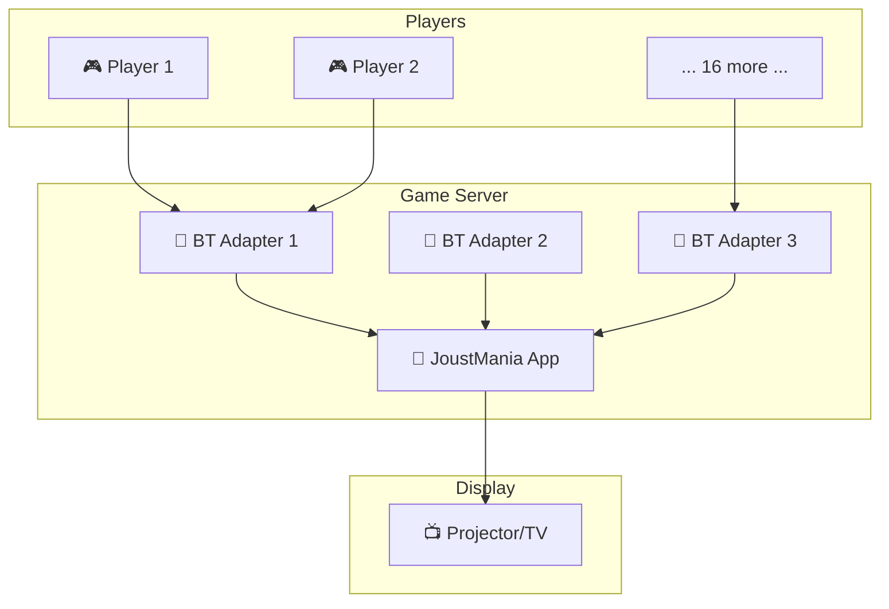
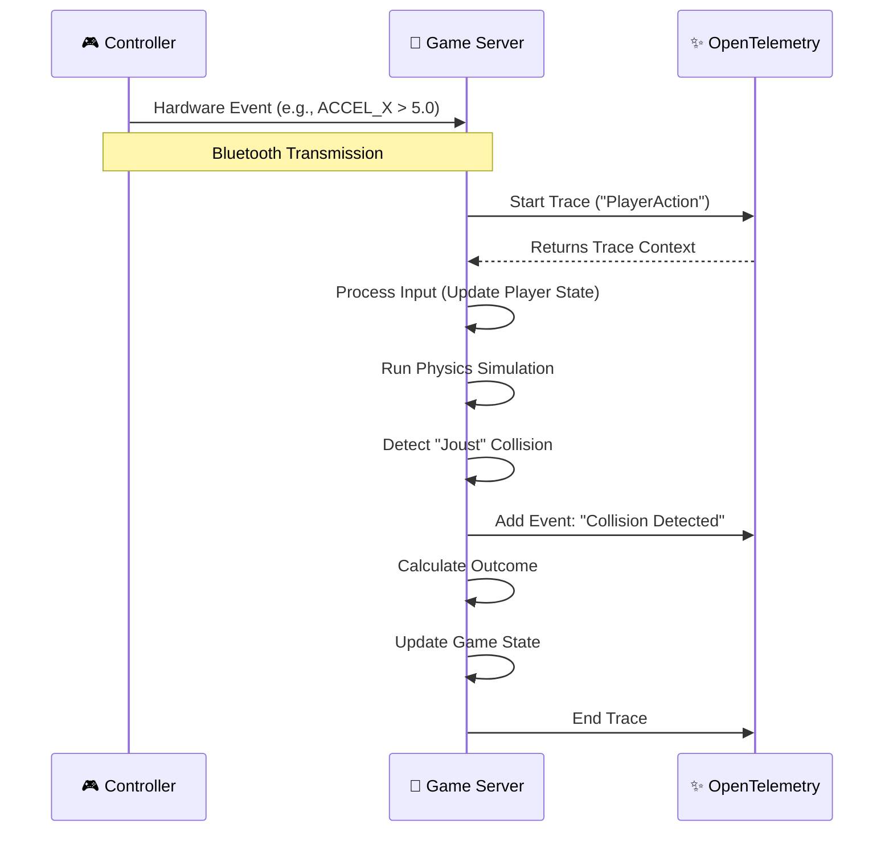

# 18 Bluetooth Controllers Walk Into a Bar
## Observability & Runtime Configuration with CNCF Tools

**Simon Schrottner**, Senior Software Engineer, Dynatrace<br>
**Manuel Timelthaler**, Software Architect, Tractive

<div class="abs-br m-6 flex gap-2">
  Cloud Native Linz, February 2026
</div>

<!--
Speaker Notes:
- Welcome everyone.
- Briefly introduce the title and the core idea: applying familiar CNCF tools to a weird, fun problem.
-->

---
layout: two-cols
---


# Simon Schrottner{.mt-24}

Senior Software Engineer, **Dynatrace**

- Open source enthusiast.
- Core contributor to **OpenFeature**, driving its growth and adoption.
- Passionate about making modern observability accessible to everyone.

::right::


# Manuel Timelthaler{.mt-24}

Software Architect, **Tractive**

- Helps teams build scalable systems and grow as engineers.
- Over a decade of experience from front-end to cloud architecture.
- Loves connecting people, process, and tech to build better software together.

---
layout: center
class: text-center
---

# Let's talk about... a party game?

<div class="flex justify-center items-center">
    
</div>

**JoustMania:** An open-source party game where players physically jostle motion controllers.

Sounds simple, right? What could possibly go wrong?

---
layout: default
---

# The "2 AM at a Convention" Problem

You're running a booth, the game is a hit. Then, a player comes to you and says:

<div class="bg-gray-800 p-4 rounded-lg text-center">
  <p class="text-2xl text-amber-300">“My controller just... felt different this round.”</p>
</div>

- Was it lag?
- A dying battery?
- A problem with the Bluetooth adapter?
- The game's physics engine?
- Or just... their imagination?

**How do you debug a *feeling* in a distributed system of physical devices?**

---
layout: default
zoom: 75%
---

# Our Distributed System

This isn't your typical microservice architecture.



**Challenges:**
- **18 concurrent devices:** Each with its own battery, sensor, and connection quality.
- **High-frequency data:** Sensors report at 100 Hz. `18 * 100 = 1800` events/second.
- **High cardinality:** Every controller is a unique data source. `player_id`, `controller_id`, `session_id`...
- **"Noisy" environment:** Bluetooth is notoriously fickle, especially in a crowded convention hall.

---
layout: default
---

# Challenge 1: The Data Deluge

How do you sample data without overwhelming your telemetry backend (and your wallet)?

`18 controllers * 100 samples/sec * 3600 sec/hr = 6,480,000` data points per hour.

- We can't just log everything.
- We can't just sample randomly, or we'll miss the important stuff.
- We need **intelligent, context-aware sampling.**

What if we could sample more when the battery is low, or when a player is in a critical "joust"?

---
layout: default
---

# Challenge 2: Correlating Everything

A player's action isn't a single event. It's a chain reaction.



**The Goal:** We need to link the initial hardware event to the final game logic outcome. We need distributed tracing for the physical world.

---
layout: section
---

# Our Solution: The CNCF Toolbox

Let's apply battle-tested cloud-native tools to this unconventional problem.

- **OpenFeature** for runtime configuration and dynamic control.
- **OpenTelemetry** for observability, tracing, and intelligent sampling.

---
layout: default
---

# OpenFeature: More Than Just A/B Testing

We use feature flags to dynamically change the game's behavior at runtime, without redeploying.

A flag isn't just `true` or `false`. It can be a string, a number, or even structured JSON.

```yaml [flags.yaml (synced from GitHub)]{all|1-13|14-20}
joust-sensitivity:
  variants:
    low: 0.8
    normal: 1.0
    high: 1.2
  defaultVariant: normal
  contextual:
    - when:
        playerSkill: "newbie"
      variant: low
    - when:
        batteryLevel: "critical"
      variant: high # Compensate for potential sensor lag?

telemetry-sampling-rate:
  variants:
    off: 0
    debug: 100 # Sample everything
    normal: 10 # Sample 10% of events
  defaultVariant: normal
```

---
layout: default
---

# Flags Driven by Real-World Context

We use a **custom OpenFeature provider** that enriches the evaluation context with real-time data.

```typescript
// Placeholder: How we evaluate a flag
const featureFlags = openFeatureClient.forContext({
  // Static context
  playerId: 'player-4',
  playerSkill: 'pro',

  // Dynamic context from the game!
  batteryLevel: getBatteryPercent('C4:B3:A1:D5:32:F1'), // "healthy"
  systemLoad: getCpuUsage(), // "high"
});

const samplingRate = featureFlags.getNumberValue('telemetry-sampling-rate', 10);
const joustSensitivity = featureFlags.getNumberValue('joust-sensitivity', 1.0);

// Now, use these values to change game logic...
if (Math.random() < (samplingRate / 100)) {
  // send telemetry data
}
```

This allows us to create powerful, emergent behavior.

---
layout: default
---

# OpenTelemetry: Proving the Game is "Rigged"

With tracing, we can finally answer the age-old question: *Is this game fair?*

A player complains about a lost joust. We can pull up the trace.

<div class="bg-gray-800 p-4 rounded-lg text-xs">
**Trace ID: `a1b2c3d4`**
- **`player-action`**: `[span | duration: 150ms]`
  - `controller-event`: `{accel_x: 9.8, timestamp: ...}`
  - `game-logic`: `{is_collision: true, opponent: 'player-7'}`
  - `attribute`: `{opponent_battery: 95%}`
  - `attribute`: `{player_battery: 21%}`
  - `event`: `JoustOutcome: Loss`
  - **`analysis_result`**: `{flag_evaluation: {joust-sensitivity: 1.2}, reason: 'batteryLevel was critical'}`
</div>

**Aha!** The player's battery was low, a feature flag kicked in to increase sensitivity, which may have made their movements *too* sensitive. It's not rigged, it's *context-aware*!

---
layout: section
---

# Live Demo (~5 mins)

**Our Plan:**
1.  We'll start a **live game** with two players.
2.  You'll see the **live telemetry** stream on the screen as they play.
3.  We'll analyze the data using **prepared screenshots** to show you exactly what to look for. (This way, the demo gods can't hurt us).
4.  We will have a fallback video, just in case.

Let's see it in action!

---
layout: default
---

# Live Telemetry (Screenshot)

Here's an example of the data we're capturing.

<div class="flex justify-center items-center my-4">
  
</div>

**What you're seeing:**
- **Blue Line:** Controller 1's accelerometer data. Notice the spike during a "joust".
- **Green Line:** Controller 2's data. Much smoother.
- **Annotations:** The vertical lines mark game events, like `Collision` or `Player_Win`, which are correlated with our trace data.
- **Top Right:** Key stats like battery level and connection RSSI.

---
layout: default
---

# Why This Matters for the Ecosystem

Most OpenTelemetry and OpenFeature examples focus on web apps and microservices.

**But the principles are universal:**
- **Decouple configuration from code:** (`OpenFeature`)
- **Understand your system's behavior:** (`OpenTelemetry`)

This talk shows that these CNCF tools are powerful enough for:
- **Gaming:** Real-time performance tuning and cheat detection.
- **IoT & Edge:** Managing fleets of devices in the field.
- **Physical Systems:** Debugging interactions between hardware and software.

If it works for 18 hyperactive Bluetooth controllers, it can probably work for your system, too.

---
layout: cover
class: text-center
---

# Thank You!

<div>

**Simon Schrottner**<br>
@aepfli · github.com/aepfli

**Manuel Timelthaler**<br>
github.com/Lorti

**Project Repo & Slides**<br>
[github.com/WatchMeJoustMyFlags/cloud-native-linz](https://github.com/WatchMeJoustMyFlags/cloud-native-linz)

</div>

## Questions?