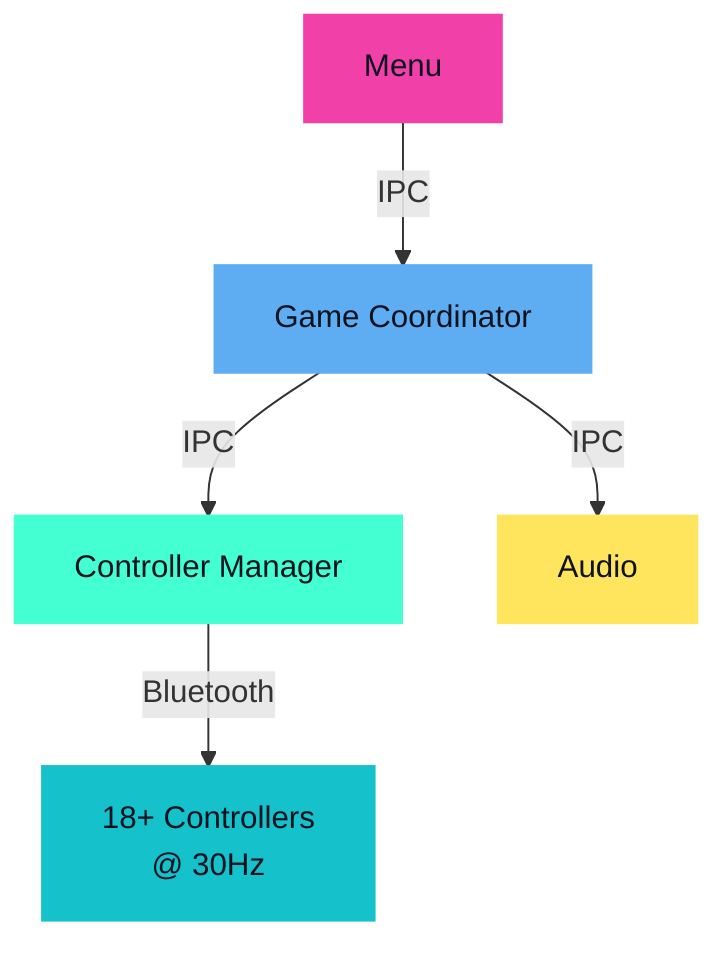
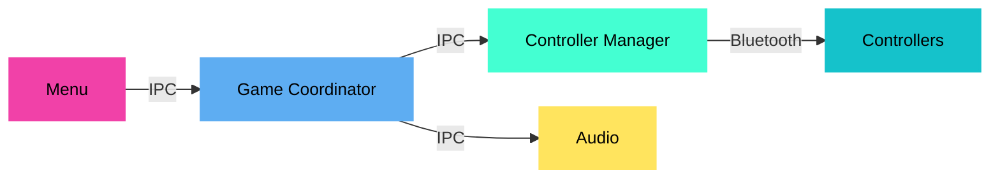
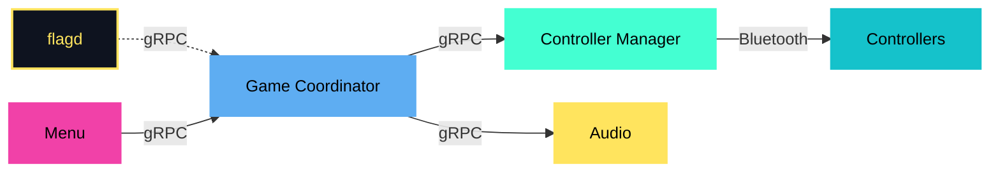
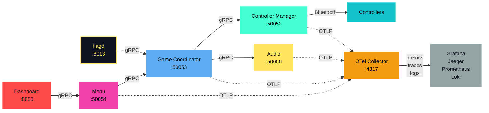
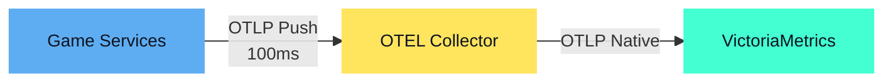
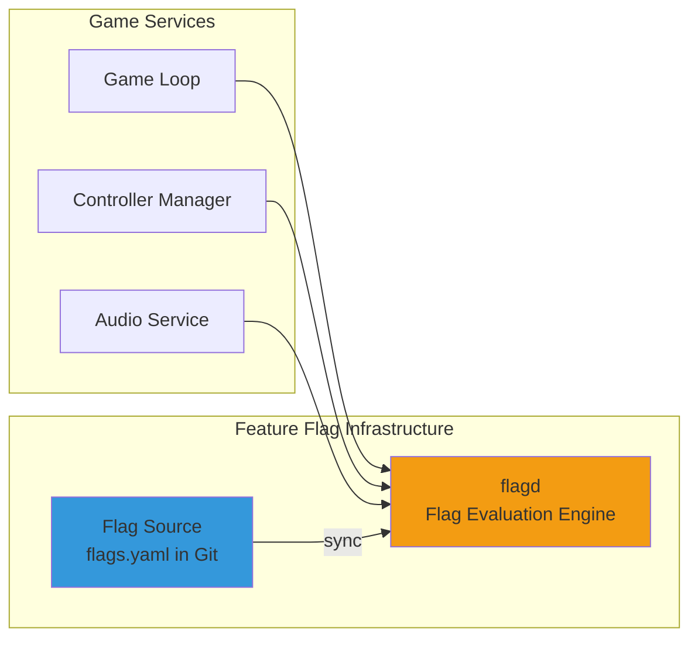

# 18 Bluetooth Controllers Walk Into a Bar
## Observability & Runtime Configuration with CNCF Tools

<div class="grid grid-cols-2 px-4 mx-auto mt-12 text-left">
<div class="flex items-center gap-2">
  
  <div class="leading-tight">
    <p class="!text-xl font-bold !mt-0 !mb-0">Simon Schrottner</p>
    <p class="!text-lg !mt-0 !mb-0">Senior Software Engineer, Dynatrace</p>
  </div>
</div>
<div class="flex items-center gap-2">
  
  <div class="leading-tight">
    <p class="!text-xl font-bold !mt-0 !mb-0">Manuel Timelthaler</p>
    <p class="!text-lg !mt-0 !mb-0">Software Architect, Tractive</p>
  </div>
</div>
</div>

<div class="abs-br m-6 flex gap-2">
  Cloud Native Linz, February 2026
</div>

<!--
Speaker Notes:
- Welcome everyone.
- Briefly introduce the title and the core idea: applying familiar CNCF tools to a weird, fun problem.
-->

---
layout: center
class: text-center
---

# What is JoustMania?

<div class="flex justify-center items-center my-8">
    
</div>

**A motion-controlled party game for up to 18+ PlayStation Move controllers**

Keep your controller still, jostle everyone else's.<br>
_No screens, just glowing controllers and chaos._

<!--
Speaker Notes (Manuel leads - 2:30):
- Brief intro to JoustMania
- "Motion-controlled party game"
- "2 to 18+ controllers - we've had up to 20 at conventions"
- "No screens, just glowing controllers and chaos"
- Sets up the technical challenge ahead
-->

---
layout: default
---

# Original Architecture (IPC-Based)

<div class="grid grid-cols-2">
<div>

**Before observability:**

- Process-based (multiprocessing)
- 30 Hz game loop (33ms frames)
- IPC via queues/shared memory
- 4 Python processes

**The problem:** OpenTelemetry needs network calls for context propagation

</div>
<div class="-mt-8">



</div>
</div>

<!--
Speaker Notes (Manuel - 2:30-5:00):
- "This is how JoustMania originally worked"
- "Process-based architecture with IPC"
- "No network calls, just local processes talking via pipes"
- "This sets up Learning 1 - we had to refactor this"
- "No error messages, just glowing controllers and chaos"
-->

---
layout: center
class: text-center
---

# What If We Actually Observed This Thing?

<div class="grid grid-cols-3 gap-x-16 gap-y-8 items-end justify-items-center my-12 px-12">
  <div class="flex flex-col items-center gap-2">
    
    <span class="text-sm text-gray-400">Telemetry Collection</span>
  </div>
  <div class="flex flex-col items-center gap-2">
    
    <span class="text-sm text-gray-400">Metrics Storage</span>
  </div>
  <div class="flex flex-col items-center gap-2">
    
    <span class="text-sm text-gray-400">Distributed Tracing</span>
  </div>
  <div class="flex flex-col items-center gap-2">
    
    <span class="text-sm text-gray-400">Visualization</span>
  </div>
  <div class="flex flex-col items-center gap-2">
    
    <span class="text-sm text-gray-400">Log Aggregation</span>
  </div>
  <div class="flex flex-col items-center gap-2">
    
    <span class="text-sm text-gray-400">Feature Flags</span>
  </div>
</div>

<div class="text-2xl mt-8 text-amber-300">
What could possibly go wrong?
</div>

<!--
Speaker Notes (Manuel - ~5:00):
- "I'm Manuel, by the way. Still don't work on hardware."
- "We wanted to see if CNCF observability tools could handle this"
- "OpenTelemetry, Prometheus, Grafana, Jaeger, OpenFeature"
- "What could possibly go wrong?"
- Transition: "We learned 6 things..."
-->

---
layout: section
class: text-center
---

# The Journey: 6 Learnings

What we discovered bringing CNCF tools to a real-time game

---
layout: default
---

# Learning 1: Had to Refactor to Microservices

**Problem:** IPC (pipes/queues) doesn't work with OpenTelemetry auto-instrumentation

<div class="grid grid-cols-3 gap-8 items-center mb-8">
<div>

### <span class="text-lg">Before</span><br>Process-Based IPC

</div>
<div class="col-span-2">



</div>
</div>

<div class="grid grid-cols-3 gap-8 items-center">
<div>

### <span class="text-lg">After</span><br>gRPC Microservices

</div>
<div class="col-span-2">



</div>
</div>

---
layout: default
---

# Learning 1: The Full Picture

**gRPC microservices enabled the observability stack**<br>
W3C trace context flows through calls, enabling distributed tracing



<!--
Speaker Notes (Simon - 5:00-6:30):
- "We figured we'd just add OTel and call it a day. Not even close."
- "IPC doesn't propagate trace context"
- "Had to refactor to gRPC microservices"
- "Once we did that, auto-instrumentation just worked"
-->

---
layout: default
---

# Learning 2: The Raspberry Pi Can Handle It

<iframe 
    src="http://himbeere.local/grafana/d/joustmania-host-metrics/joustmania-host-metrics-raspberry-pi?orgId=1&refresh=5s&kiosk" 
    width="100%" 
    height="400" 
    frameborder="0" 
    class="rounded-lg shadow-lg"></iframe>

<!--
Speaker Notes (Simon - 6:30-7:15):
- "The Pi didn't even break a sweat"
- Show dashboard with CPU, memory, temperature
- "Running OpenTelemetry Collector, Prometheus, Grafana, Jaeger"
- "All on a Raspberry Pi 4"
-->

---
layout: default
---

# Learning 2: Pi Performance

<div class="grid grid-cols-2 gap-12 my-8">
<div>

### Raspberry Pi 5 Specs
- Quad-core ARM Cortex-A76 @ 2.4GHz
- 8GB LPDDR4X RAM
- ~$80 USD

</div>
<div>

### Observed Performance
- CPU: ~45% under full load
- Memory: ~850 MB / 8 GB (10%)
- Temp: 65°C (with fan cooling)
- 18 controllers @ 60Hz

</div>
</div>

**The Pi runs both the game AND the full observability stack** — we didn't think this was possible initially, though you could also send telemetry to external services.

<!--
Speaker Notes (Manuel - 7:15-8:00):
- "The Pi didn't even break a sweat"
- "Though we did cap retention at 7 days"
-->

---
layout: default
---

# Learning 3: Cardinality Low, Volume High

<iframe src="http://himbeere.local/grafana/d/joustmania-system-overview/joustmania-system-overview?orgId=1&refresh=5s&kiosk" width="100%" height="400" frameborder="0" class="rounded-lg shadow-lg"></iframe>

<!--
Speaker Notes (Simon - 8:00-8:30):
- "Cardinality surprisingly low, volume surprisingly high"
- Show dashboard with message rates
-->

---
layout: default
---

# Learning 3: Volume Over Cardinality

<div class="grid grid-cols-2 gap-12 my-8">
<div>

### ✅ Cardinality: Low
- Only 20-30 unique metric names
- Manageable label combinations
- Not the bottleneck

</div>
<div>

### ⚠️ Volume: High
- 18 controllers @ 60Hz
- ~1,080 messages/second
- **Solution: Batching & aggregation**

</div>
</div>

**Batching at the source prevented cardinality explosion** — aggregating controller events before exporting kept metric counts low while handling high message volume.

<!--
Speaker Notes (Simon - 8:30-9:00):
- "Only tracking 20-30 different metrics"
- "But 18 controllers at 60Hz means over 1,000 messages per second"
- "Batching and aggregation at the source saved us"
-->

---
layout: default
---

# Learning 3: Two Batching Strategies

<div v-click="1">

### Level 1: Application → Collector

```python {2-4|all}
init_metrics(
    service_name="controller-manager",
    export_interval_ms=flagd.get_int("metrics_export_interval_ms")
    # controller-manager: 100ms (realtime) | other services: 1000ms
)
```

</div>

<div v-click="2">

### Level 2: Collector → Backends

```yaml {2-4|all}
processors:
  batch/fast:
    timeout: 100ms          # Send batch every 100ms
    send_batch_size: 1000   # Or when 1000 data points collected
```

</div>

<div v-click="3">

**100ms exports** + **1000-item batching** gives subsecond observability without overwhelming backends

</div>

---
layout: default
---

# Learning 4: Prometheus is Too Slow

**The Mismatch:**

<div class="my-8 font-mono text-sm">

```
Prometheus Scrape:  |--------15s--------|--------15s--------|--------15s--------|
                    ↓                    ↓                    ↓

Game Events:        ▲▲▲▲▲▲▲▲▲▲▲▲▲▲▲▲▲▲▲▲▲▲▲▲▲▲▲▲▲▲▲▲▲▲▲▲▲▲▲▲▲▲▲▲▲▲▲▲▲▲▲▲▲▲▲▲▲▲▲▲
                    ↑ Frame drop here? Won't see it for 15 seconds!
```

</div>

**Problem:**
- **Prometheus default:** 15-second scrape interval
- **Game loop:** 60Hz (16ms per frame)
- **By the time you see a scrape, the game is over**

**We needed something faster.**

<!--
Speaker Notes (Manuel - 9:00-10:00):
- "15-second scrapes... with 15s scrapes, we'd miss entire matches"
- "Game runs at 60Hz - that's 16 milliseconds per frame"
- "By the time Prometheus scraped, 900 frames had already happened"
- "We needed something faster"
-->

---
layout: default
---

# Learning 4: Prometheus Pull in Action

<iframe src="http://himbeere.local/grafana/d/metrics-pipeline-comparison/metrics-pipeline-comparison?orgId=1&refresh=5s&kiosk" width="100%" height="400" frameborder="0" class="rounded-lg shadow-lg"></iframe>


**What you see** — chunky, low-resolution data with significant gaps. By the time you see an issue, it's already over.

<!--
Speaker Notes (Manuel):
- "This is what Prometheus pull looks like in practice"
- "See those gaps? That's 15 seconds of game state we'll never see"
- "We tuned it down to 1 second, which helped, but still felt laggy"
- "That's when we remembered—push metrics exist"
-->

---
layout: default
---

# Learning 5: Push Metrics with Prometheus

**OTLP Push via PeriodicExportingMetricReader**

```python
# OpenTelemetry SDK Configuration
metric_reader = PeriodicExportingMetricReader(
    exporter=OTLPMetricExporter(endpoint="http://otel-collector:4318"),
    export_interval_millis=flagd.get_int("metrics_export_interval_ms")
    # controller-manager: 100ms (realtime) | other services: 1000ms
)
```

<div class="my-4">


</div>

**Reality check** — We export at 100ms, but Prometheus remote write can only achieve ~500ms resolution due to write path limitations. Still **30x faster** than 15s scrape, but not real-time yet.

<!--
Speaker Notes (Manuel):
- "We'd both been doing pull-based metrics for so long we almost forgot"
- "Push-based metrics via OTLP with 100ms interval"
- "150x faster feedback than default Prometheus scrape"
- "Much better, but we wondered—can we go even faster?"
-->

---
layout: default
---

# Learning 5: VictoriaMetrics for Hardware

<div class="grid grid-cols-2 gap-8 my-8">
<div>

### Prometheus Limitations
- Built for web app monitoring
- Remote write adds latency
- Limited ingestion rate
- Storage not optimized for high-frequency data

</div>
<div>

### VictoriaMetrics Benefits
- **Native OTLP support** (no conversion)
- **10x higher ingestion rate**
- **Better compression** for time-series
- **Optimized for IoT/hardware** use cases

</div>
</div>



**Result** — Sub-100ms resolution, native OTLP, built for hardware observability.

<!--
Speaker Notes (Manuel):
- "Prometheus is great, but it's built for web apps"
- "VictoriaMetrics is designed for high-frequency IoT and hardware data"
- "Native OTLP support means no conversion overhead"
- "We went from 15 seconds to sub-100 milliseconds"
-->

---
layout: default
---

# Learning 5: The Three Approaches Compared

<iframe src="http://himbeere.local/grafana/d/metrics-pipeline-comparison/metrics-pipeline-comparison?orgId=1&refresh=5s&kiosk" width="100%" height="400" frameborder="0" class="rounded-lg shadow-lg"></iframe>


<div class="grid grid-cols-3 gap-4 mt-4 text-sm">
<div>

**Prometheus Pull**
- ~10s resolution
- ~6 samples/min

</div>
<div>

**Push → Prometheus**
- ~500ms resolution
- ~120 samples/min

</div>
<div>

**Push → VictoriaMetrics**
- <100ms resolution
- ~600+ samples/min

</div>
</div>

<!--
Speaker Notes (Manuel):
- "Here's all three side by side"
- "Prometheus pull: 10 seconds. Way too slow."
- "Push to Prometheus: We export at 100ms, but Prometheus can only write at 500ms. Its write path is the bottleneck."
- "Push to VictoriaMetrics: Full 100ms resolution. This is what real-time looks like."
- "The journey: 10s → 500ms → 100ms"
-->

---
layout: default
---

# Learning 6: These Tools Actually Work

<iframe src="http://localhost:16686/trace/[trace-id]?uiTheme=dark" width="100%" height="400" frameborder="0" class="rounded-lg shadow-lg"></iframe>


<!--
Speaker Notes (Manuel - 11:30-13:00):
- "These tools actually work for real-time hardware"
- "This is a Jaeger trace of a game loop"
- "You can see each step: controller poll, motion processing, collision detection"
- Simon adds: "And when that lag happened at the conference? We can now see exactly where it came from. It's Bluetooth."
-->

---
layout: section
class: text-center
---

# Live Demo

**"Let's break something in real-time"**

18 mock controllers running right now

We'll change the game frequency and watch metrics respond

---
layout: two-cols
---

# Push Metrics Comparison - Part 1

<div class="text-center">
  <iframe
    src="http://himbeere.local/grafana/d/metrics-pipeline-comparison/metrics-pipeline-comparison?orgId=1&refresh=5s&kiosk"
    width="100%"
    height="400"
    frameborder="0"
    class="rounded-lg shadow-lg"
  ></iframe>

  
</div>

**Three pipelines, same metric:**
1. Prometheus Pull (10s, ~6 samples/min)
2. OTEL→Prometheus (500ms, ~120 samples/min)
3. OTEL→VictoriaMetrics (<100ms, ~600 samples/min)

::right::

# Flag Controls

<div class="h-full flex items-center justify-center">
  <iframe
    src="http://localhost:8080/flags-ui"
    width="350"
    height="550"
    frameborder="0"
    class="rounded-lg shadow-lg border-2 border-gray-600"
  ></iframe>

  <div class="text-center p-8 bg-gray-800 rounded-lg shadow-lg">
    <p class="text-lg mb-4"><strong>Flag UI Placeholder</strong></p>
    <p class="text-sm mb-6">update_frequency_hz</p>
    <div class="bg-gray-700 p-4 rounded">
      <p class="text-3xl font-bold mb-2">30 Hz</p>
      <input type="range" min="30" max="100" value="30" class="w-full" />
    </div>
    <p class="text-xs mt-4 text-gray-400">Real-time feature flag control</p>
  </div>
</div>

<!--
Speaker Notes (Manuel/Simon - 13:00-15:30):
- Manuel: "This dashboard shows game loop frequency—right now we're at 30Hz"
- Simon: "Increasing to 60Hz" (changes flag)
- Manuel: "And... there it goes. Look at the jump..."
- Manuel narrates the differences in each graph
- "Notice how Prometheus pull barely shows the change"
- "But VictoriaMetrics? You can see the exact moment"
-->

---
layout: two-cols
---

# Push Metrics Comparison - Part 2

<div class="text-center">
  <iframe
    src="http://himbeere.local/grafana/d/metrics-pipeline-comparison/metrics-pipeline-comparison?orgId=1&refresh=5s&kiosk&viewPanel=victoriametrics-panel"
    width="100%"
    height="400"
    frameborder="0"
    class="rounded-lg shadow-lg"
  ></iframe>

  
</div>

**VictoriaMetrics with <100ms resolution:**

You can see **individual game loop iterations**

That's what you need for real-time debugging.

::right::

# Flag Controls

<div class="h-full flex items-center justify-center">
  <iframe
    src="http://localhost:8080/flags-ui"
    width="350"
    height="550"
    frameborder="0"
    class="rounded-lg shadow-lg border-2 border-gray-600"
  ></iframe>

  <div class="text-center p-8 bg-gray-800 rounded-lg shadow-lg">
    <p class="text-lg mb-4"><strong>Flag UI Placeholder</strong></p>
    <p class="text-sm mb-6">update_frequency_hz</p>
    <div class="bg-gray-700 p-4 rounded">
      <p class="text-3xl font-bold mb-2">60 Hz</p>
      <input type="range" min="30" max="100" value="60" class="w-full" />
    </div>
    <p class="text-xs mt-4 text-gray-400">Real-time feature flag control</p>
  </div>
</div>

<!--
Speaker Notes (Manuel - 15:30-17:00):
- "Look at VictoriaMetrics closely"
- "You can see individual game loop iterations"
- "That's what you need for real-time debugging"
- "This is the difference between knowing and guessing"
-->

---
layout: two-cols
---

# Breaking Point

<div class="space-y-2">
  <iframe
    src="http://himbeere.local/grafana/d/host-metrics/host-metrics?orgId=1&refresh=5s&kiosk&viewPanel=cpu-panel"
    width="100%"
    height="240"
    frameborder="0"
    class="rounded-lg shadow-lg"
  ></iframe>

  

  <iframe
    src="http://localhost:16686/trace/[trace-id]?uiTheme=dark"
    width="100%"
    height="240"
    frameborder="0"
    class="rounded-lg shadow-lg"
  ></iframe>

  
</div>

::right::

# Flag Controls

<div class="h-full flex items-center justify-center">
  <iframe
    src="http://localhost:8080/flags-ui"
    width="350"
    height="550"
    frameborder="0"
    class="rounded-lg shadow-lg border-2 border-gray-600"
  ></iframe>

  <div class="text-center p-8 bg-gray-800 rounded-lg shadow-lg">
    <p class="text-lg mb-4"><strong>Flag UI Placeholder</strong></p>
    <p class="text-sm mb-6">update_frequency_hz</p>
    <div class="bg-gray-700 p-4 rounded">
      <p class="text-3xl font-bold mb-2 text-red-400">100 Hz</p>
      <input type="range" min="30" max="100" value="100" class="w-full" />
    </div>
    <p class="text-xs mt-4 text-red-400">⚠️ System at capacity</p>
  </div>
</div>

<!--
Speaker Notes (Simon/Manuel - 17:00-19:00):
- Simon: "Should I crank it all the way up?"
- Manuel: "Do it."
- Simon: Adjusts flag to 100Hz
- Manuel: "Aaand there's our CPU ceiling. 87%. Frame drops starting to appear."
- "Look at the Jaeger trace - controller poll time just jumped from 2ms to 40ms"
- Simon: "Rolling back... Done. Performance restored."
- "No restart. No deploy. Just OpenFeature."
-->

---
layout: default
---

# 4 Key Takeaways

<div class="space-y-6 text-lg">

**1. CNCF tools work for games, IoT, embedded systems—not just web apps**

**2. But they're optimized for web apps (default configs don't fit)**

**3. With tuning, you can get subsecond observability on an $80 computer**

**4. The tools exist. The patterns exist. What's missing is the documented path.**

</div>

<!--
Speaker Notes (Manuel - 19:00-21:00):
- Walk through each takeaway
- "These tools work for real-time systems"
- "But you need to tune them - defaults are for web apps"
- "We got subsecond observability on a Raspberry Pi"
- "The community needs more examples like this"
-->

---
layout: center
class: text-center
---

# Where's the Real-Time Systems Demo?

<div class="my-8">
  
</div>

**Where's the game engine demo? The embedded systems? The IoT sensor networks? The edge computing?**

<div class="text-xl mt-8 text-amber-300">
Let's document what works, share tuning tricks, contribute examples.
</div>

<!--
Speaker Notes (Manuel - 21:00-22:00):
- "Look at the OpenTelemetry demo - all web services"
- "Where's the game engine? The robotics? The real-time systems?"
- "We need more examples outside of web apps"
- "Let's document what works and share it"
-->

---
layout: center
class: text-center
---

# JoustMania is Open Source

<div class="my-8 text-6xl">
📦 🎮 🚀
</div>

**Everything we showed you today is open source**

Fork it. Break it. Make it better.

<div class="text-xl mt-8">
  <a href="https://github.com/adangert/JoustMania" class="text-blue-400">github.com/adangert/JoustMania</a>
</div>

<div class="mt-8">
  
  <p class="text-sm mt-2">Scan for GitHub repo</p>
</div>

<!--
Speaker Notes (Manuel - 22:00-22:30):
- "Everything is open source"
- "Fork it, break it, make it better"
- "We'd love to see what you build"
-->

---
layout: cover
class: text-center
---

# Thank You!

<div class="grid grid-cols-2 gap-8 max-w-2xl mx-auto mt-8">
<div>

**Simon Schrottner**

Senior Software Engineer, Dynatrace

[@aepfli](https://github.com/aepfli) · [github.com/aepfli](https://github.com/aepfli)

</div>
<div>

**Manuel Timelthaler**

Software Architect, Tractive

[github.com/Lorti](https://github.com/Lorti)

</div>
</div>

<div class="mt-12">

**Project Repo & Slides**

[github.com/WatchMeJoustMyFlags/kubecon-material](https://github.com/WatchMeJoustMyFlags/kubecon-material)

</div>

<div class="text-2xl mt-8">
Questions? 🎮
</div>

<!--
Speaker Notes (Both - 22:30-23:00):
- Thank the audience
- Open for questions
- Direct people to GitHub for code
-->

---
layout: section
class: text-center
---

# Bonus Slides

Technical Deep-Dives

_(If time permits)_

---
layout: default
---

# Bonus: Cardinality Lifecycle Management

**Pattern: Clean up metrics when controllers disconnect**

```python {all|8-12}
class ControllerMetrics:
    def __init__(self, controller_id: str):
        self.controller_id = controller_id
        self.acceleration = meter.create_histogram(
            name="controller.acceleration",
            unit="g",
        )

    def cleanup(self):
        """Remove metrics when controller disconnects"""
        # OpenTelemetry doesn't have built-in cleanup yet
        # So we use a TTL pattern with labels
        self.acceleration.record(
            0,
            attributes={"controller_id": self.controller_id, "disconnected": "true"}
        )
```

**Key Insight:** Label lifecycle matters in high-churn environments

<!--
Bonus content for technical audiences interested in cardinality management
-->

---
layout: default
zoom: 85%
---

# Bonus: Manual gRPC Tracing

**When auto-instrumentation isn't enough**

```python {all|5-8|10-14|16-19}
from opentelemetry import trace
from opentelemetry.propagate import inject

def call_game_service(request):
    # Create a new span
    tracer = trace.get_tracer(__name__)
    with tracer.start_as_current_span("call_game_service") as span:
        span.set_attribute("game.mode", request.mode)

        # Inject trace context into gRPC metadata
        metadata = {}
        inject(metadata)  # W3C Trace Context
        grpc_metadata = [(k, v) for k, v in metadata.items()]

        # Make the gRPC call with propagated context
        response = game_stub.UpdateGameState(
            request,
            metadata=grpc_metadata
        )

        return response
```

**Result:** Context propagation across all microservices

<!--
Bonus content showing how we manually instrumented gRPC calls
-->

---
layout: default
---

# Bonus: OpenFeature + flagd Architecture

**Runtime configuration without redeploy**



**Key Benefits:**
- **No restarts** required for config changes
- **Context-aware** flags (battery level, system load, player skill)
- **Git-backed** source of truth for all flags

<!--
Bonus content about OpenFeature architecture
-->

---
layout: default
---

# Bonus: Test-Friendly Observability

**Pattern: Lazy initialization for clean tests**

```python {all|3-6|8-11}
class GameService:
    def __init__(self):
        # Don't initialize telemetry in __init__
        # Let it be lazy-loaded on first use
        self._meter = None
        self._tracer = None

    @property
    def meter(self):
        if self._meter is None:
            self._meter = get_meter(__name__)
        return self._meter
```

**Why this matters:**
- Unit tests don't need telemetry infrastructure
- Integration tests can inject test collectors
- Production gets full observability

**Pattern:** Lazy initialization + dependency injection

<!--
Bonus content about testing with observability
-->

---
layout: default
---

# Bonus: Architecture Simplification

**Before vs After adding observability**

<div class="grid grid-cols-2 gap-4">
<div>

**Before (IPC Hell)**
- 4 services with IPC
- Supervisor process for coordination
- Custom health checking
- Manual log aggregation
- No correlation between events

</div>
<div>

**After (gRPC + OpenTelemetry)**
- 4 services with gRPC
- No supervisor needed! (Kubernetes handles it)
- Health checks via gRPC health protocol
- Structured logs with trace IDs
- Automatic correlation via trace context

</div>
</div>

**Surprising outcome:** Adding observability simplified the architecture

**We removed ~500 lines of custom coordination code**

<!--
Bonus content about how observability simplified our architecture
-->
