# 18 Bluetooth Controllers Walk Into a Bar
## Observability & Runtime Configuration with CNCF Tools

<div class="grid grid-cols-2 px-4 mx-auto mt-12 text-left">
<div class="flex items-center gap-2">
  
  <div class="leading-tight">
    <p class="!text-xl font-bold !mt-0 !mb-0">Simon Schrottner</p>
    <p class="!text-lg !mt-0 !mb-0">Dynatrace</p>
  </div>
</div>
<div class="flex items-center gap-2">
  
  <div class="leading-tight">
    <p class="!text-xl font-bold !mt-0 !mb-0">Manuel Timelthaler</p>
    <p class="!text-lg !mt-0 !mb-0">Tractive</p>
  </div>
</div>
</div>

<div class="abs-br m-6 flex gap-2">
  Cloud Native Linz, February 2026
</div>

---
layout: center
class: text-center
---

# What is JoustMania?

<JsJoustGallery />

**A motion-controlled party game for up to 18+ PlayStation Move controllers**

Keep your controller still, jostle everyone else's.<br>
_No screens, just glowing controllers and chaos._

<div class="abs-br m-4 text-xs text-right opacity-50" style="max-width: 340px;">
  Photos by Brent Knepper, Sara Bobo, and Die Gute Fabrik; showing original J.S. Joust game
</div>

---
layout: center
---

<v-clicks>

# How do we know what's going on?

# What if we added observability tools?

# What if we added feature flags too?

</v-clicks>

<style>
h1:nth-of-type(1)::before {
  background: var(--slidev-theme-accents-blue) !important;
}
h1:nth-of-type(2)::before {
  background: var(--slidev-theme-accents-blue) !important;
  transform: rotate(1deg) !important;
}
h1:nth-of-type(3)::before {
  background: var(--slidev-theme-accents-blue) !important;
}
</style>

---
layout: default
---

# Agenda

<div class="text-xl mt-16 space-y-6">

1. **The Challenge** — Why observability for a party game?

2. **The Journey** — 7 key learnings from instrumentation to subsecond metrics

3. **Live Demo** — Watch metrics respond in real-time as we change the game

4. **The Path Forward** — What's missing and how you can help

</div>

---
layout: section
---

# The Journey: 7 Learnings

What we discovered bringing CNCF tools to a real-time game

---
layout: default
---

# Learning 1: The Original Architecture

<div class="grid grid-cols-2">
<div>

- Process-based (multiprocessing)
- 30 Hz game loop (33ms frames)
- IPC via queues/shared memory
- 4 Python processes

**Problem:** IPC (pipes/queues) doesn't work with OpenTelemetry auto-instrumentation

</div>
<div class="-mt-8">


</div>
</div>

---
layout: default
---

# Learning 1: Microservices Unlocked the Stack

**gRPC microservices enabled the observability stack**<br>
W3C trace context flows through calls, enabling distributed tracing


---
layout: full
class: p-0
---
<JaegerFirstTrace
  :host="$slidev.configs.demo_host"
  service="game-coordinator-service"
  class="w-full h-full"
/>

---
layout: default
---

# Learning 2: The Raspberry Pi Can Handle It

### Raspberry Pi 5 Specs
- Quad-core ARM Cortex-A76 @ 2.4GHz
- 8GB LPDDR4X RAM
- ~$80 USD (before global memory shortage)


**The Pi runs both the game AND the full observability stack.**<br>
We didn't think this was possible initially, though you could also send telemetry to external services.

---
layout: default
---

# Learning 3: Cardinality Low, Volume High

## The Challenge
- **Cardinality:** Only 20-30 unique metric names — manageable
- **Volume:** 18 controllers @ 60Hz ≈ 1,080 messages/second

## Solution

- **Batching:** group messages before sending to the collector, and again before forwarding to backends
- **Aggregation:** push summaries, not raw telemetry

**Result:** subsecond observability without overwhelming backends — metric name cardinality
was never the issue. Label cardinality is a different story.


---
layout: default
---

# Learning 4: Pull Scraping Is Too Slow

<div class="mt-10 mb-18">

<div class="timeline-container">

  <!-- Prometheus Scrape Row -->
  <div class="flex items-center gap-4 mb-8">
    <div class="font-semibold w-48" style="color: var(--slidev-theme-accents-teal)">Prometheus Scrape</div>
    <div class="flex items-center gap-0 flex-1 relative">
      <div class="timeline-block timeline-prom py-3 relative flex-1">
        10s
        <div class="absolute -bottom-8 -left-2 text-2xl" style="color: var(--slidev-theme-accents-teal)">↓</div>
      </div>
      <div class="timeline-block timeline-prom py-3 relative flex-1" style="border-left: 0">
        10s
        <div class="absolute -bottom-8 -left-2 text-2xl" style="color: var(--slidev-theme-accents-teal)">↓</div>
      </div>
      <div class="timeline-block timeline-prom py-3 relative flex-1" style="border-left: 0">
        10s
        <div class="absolute -bottom-8 -left-2 text-2xl" style="color: var(--slidev-theme-accents-teal)">↓</div>
        <div class="absolute -right-2 -bottom-8 text-2xl" style="color: var(--slidev-theme-accents-teal)">↓</div>
      </div>
    </div>
  </div>

  <!-- Game Events Row -->
  <div class="flex items-center gap-4">
    <div class="font-semibold w-48" style="color: var(--slidev-theme-accents-rose)">Game Events</div>
    <div class="relative flex-1">
      <div class="flex items-end" :style="`gap: 2px`">
        <div v-for="i in 60" :key="i"
             class="h-8 timeline-events animate-pulse"
             :class="i <= 15 ? 'timeline-events-drop' : ''"
             :style="`flex: ${i <= 15 ? 2 - (i * 0.067) : 1}; animation-delay: ${i * 0.05}s`"></div>
      </div>
      <div class="absolute top-10 left-6 font-semibold flex items-center gap-2" style="color: var(--slidev-theme-accents-yellow)">
        <span class="text-2xl">↑</span>
        <span>Frame drop? Won't see it for 10 seconds!</span>
      </div>
    </div>
  </div>

</div>

<style>
.timeline-block {
  font-family: 'SF Mono', 'Monaco', 'Inconsolata', 'Fira Code', monospace;
  text-align: center;
  font-weight: 600;
}
.timeline-prom {
  background-color: rgba(68, 255, 210, 0.2);
  border: 2px solid var(--slidev-theme-accents-teal);
}
.timeline-events {
  background-color: var(--slidev-theme-accents-rose);
}
.timeline-events-drop {
  background-color: var(--slidev-theme-accents-red);
  opacity: 0.7;
}
</style>

</div>

- **Pull interval:** 10 seconds (we tuned from 60s default)
- **Game loop:** 60Hz (16ms per frame)
- **Result:** 600 frames between each data point

---
layout: full
class: p-0
---
<iframe
  :src="`http://${$slidev.configs.demo_host}/grafana/d/presentation-pipeline/presentation3a-pipeline-comparison?orgId=1&from=1771685894180&to=1771686034246&viewPanel=1&kiosk`"
  class="w-full h-full border-none"
/>

---
layout: default
---

# Learning 5: Push Metrics with Prometheus

**OTLP Push via PeriodicExportingMetricReader**

```python
# OpenTelemetry SDK Configuration
metric_reader = PeriodicExportingMetricReader(
    exporter=OTLPMetricExporter(endpoint="http://otel-collector:4318"),
    export_interval_millis=flagd.get_int("metrics_export_interval_ms")
    # controller-manager: 100ms (realtime) | other services: 1000ms
)
```

<div class="my-4">


</div>

**Reality check** — We export at 100ms, but Prometheus remote write can only achieve ~500ms resolution due to write path limitations. Still **30x faster** than 15s scrape, but not real-time yet.


---
layout: full
class: p-0
---
<iframe
  :src="`http://${$slidev.configs.demo_host}/grafana/d/presentation-pipeline/presentation3a-pipeline-comparison?orgId=1&from=1771685894180&to=1771686034246&viewPanel=2&kiosk`"
  class="w-full h-full border-none"
/>

---
layout: full
class: p-0
---
<iframe
  :src="`http://${$slidev.configs.demo_host}/grafana/d/presentation-pipeline/presentation3a-pipeline-comparison?orgId=1&from=1771685894180&to=1771686034246&viewPanel=3&kiosk`"
  class="w-full h-full border-none"
/>

---
layout: default
---

# Learning 6: Labels Create Cardinality, Cardinality Demands a New TSDB

<div class="grid grid-cols-2 gap-8 my-6">
<div>

### Prometheus Handles the Write Path
- **2.24% CPU** for 100ms push from 18+ controllers
- Sequential queries: **1–4ms** — no issue
- Zero dropped samples

</div>
<div>

### But Labels Multiply Series
- 114 histogram queries × 50+ `le` bucket variants
- **≈ 5,700 series lookups** per dashboard refresh
- Concurrent query p99: **182ms** → projected **450ms** on Pi 5

```mermaid {scale:1}
%%{init: {'themeVariables': {'fontSize': '14px'}, 'flowchart': {'nodeSpacing': 30, 'rankSpacing': 40}}}%%
graph LR
    Label[Add a Label] -->|× bucket variants| Series[5,700 Series Lookups]
    Series -->|concurrent reads| Prom[Prometheus\n182ms p99]
    Series -->|concurrent reads| VM[VictoriaMetrics\n76ms p99]

    style Label fill:#ffe45e,stroke:#ffe45e,stroke-width:2px,color:#0e131f
    style Series fill:#ff6b6b,stroke:#ff6b6b,stroke-width:2px,color:#0e131f
    style Prom fill:#44ffd2,stroke:#44ffd2,stroke-width:2px,color:#0e131f
    style VM fill:#f141a8,stroke:#f141a8,stroke-width:2px,color:#0e131f
```

</div>
</div>



**Result** — Prometheus could do everything. Adding a label was the tipping point:
cardinality makes VictoriaMetrics mandatory, not optional.

---
layout: default
---

<div style="display: flex; flex-direction: column; justify-content: center; height: 100%; align-items: start;">

<h1 class="my-0!">Learning 7: These Tools Actually Work</h1>

</div>

---
layout: section
---

# Live Demo: Real-time observability in action

---
layout: default
---

<ChaosDashboard />

---
layout: full
class: p-0
---
<iframe
  :src="`http://${$slidev.configs.demo_host}/grafana/d/presentation-chaos/presentation3a-chaos-demo?orgId=1&from=now-15m&to=now&refresh=5s&kiosk`"
  class="w-full h-full border-none"
/>

---
layout: full
class: p-0
---
<JaegerFirstTrace
  :host="$slidev.configs.demo_host"
  service="game-coordinator-service"
  class="w-full h-full"
/>

---
layout: default
---

# 4 Key Takeaways

<div class="grid grid-cols-2 gap-6 max-w-5xl mx-auto">

<div class="h-42 pl-14 pr-6 py-6 bg-gray-800/50 rounded-lg border border-gray-700 relative">
  <div class="absolute top-3 left-3 text-5xl font-bold text-teal-400/20">1</div>
  <div class="text-xl leading-relaxed">
    <strong>These tools work for real-time.</strong>
    <div class="mt-2 text-lg opacity-80">Games, IoT, embedded systems—anything real-time. Not just web apps.</div>
  </div>
</div>

<div class="h-42 pl-14 pr-6 py-6 bg-gray-800/50 rounded-lg border border-gray-700 relative">
  <div class="absolute top-3 left-3 text-5xl font-bold text-teal-400/20">2</div>
  <div class="text-xl leading-relaxed">
    <strong>But they're optimized for web apps.</strong>
    <div class="mt-2 text-lg opacity-80">Default configs assume 15-second scrapes, not 60Hz game loops.</div>
  </div>
</div>

<div class="h-42 pl-14 pr-6 py-6 bg-gray-800/50 rounded-lg border border-gray-700 relative">
  <div class="absolute top-3 left-3 text-5xl font-bold text-teal-400/20">3</div>
  <div class="text-xl leading-relaxed">
    <strong>With tuning, you can get subsecond observability on an $80 computer.</strong>
    <div class="mt-2 text-lg opacity-80">Intervals, push vs pull, storage backends.</div>
  </div>
</div>

<div class="h-42 pl-14 pr-6 py-6 bg-gray-800/50 rounded-lg border border-gray-700 relative">
  <div class="absolute top-3 left-3 text-5xl font-bold text-teal-400/20">4</div>
  <div class="text-xl leading-relaxed">
    <strong>The tools exist. The patterns exist.</strong>
    <div class="mt-2 text-lg opacity-80">What's missing is the documented path.</div>
  </div>
</div>

</div>


---
layout: default
---

# Where's the Real-Time Systems Demo?

<div class="grid grid-cols-2 gap-12 mt-8">

<div class="flex flex-col justify-center">
  <div class="text-xl leading-relaxed mb-8">
    Great for microservices—but where's the robotics? The game engines? The industrial IoT?
  </div>

  <div class="text-xl leading-relaxed">
    <strong class="text-amber-300">Try these tools on real-time systems.</strong> Document what works. Share tuning tricks. Contribute examples.
  </div>
</div>

<div>
  <div class="h-64">
    
    
    
  </div>
</div>

</div>

---
layout: center
class: text-center
---

# JoustMania is Open Source

**Fork it. Break it. Make it better.**

<div class="mt-8 text-lg opacity-80">

## Shoutouts

J. S. Joust · JoustMania · OTel / CNCF community

</div>

<div class="mt-8">
  
</div>

<div class="text-sm mt-4">
  <a href="https://github.com/WatchMeJoustMyFlags/JoustMania" class="text-blue-400">github.com/WatchMeJoustMyFlags/JoustMania</a>
</div>


---
layout: section
---

# _Real-Time_ Observability with CNCF Tools

---
layout: cover
class: text-center
---

# Thank You!

<div class="grid grid-cols-2 gap-8 max-w-2xl mx-auto mt-8">
<div>

**Simon Schrottner**

<div class="opacity-80">Dynatrace</div>

<div class="text-sm mt-2">

[@aepfli](https://github.com/aepfli) · [github.com/aepfli](https://github.com/aepfli)

</div>

</div>
<div>

**Manuel Timelthaler**

<div class="opacity-80">Tractive</div>

<div class="text-sm mt-2">

[github.com/Lorti](https://github.com/Lorti)

</div>

</div>
</div>

<div class="text-4xl mt-16 font-bold">
Questions? 🎮
</div>


---
layout: section
---

# What questions do you have?

<div class="mt-8">

###### Quick recap of the journey
- 10s (Prometheus pull) → 500ms (push to Prom) → <100ms (push to VictoriaMetrics)
- From web app defaults to real-time hardware observability
- Everything is open source: [github.com/WatchMeJoustMyFlags/JoustMania](https://github.com/WatchMeJoustMyFlags/JoustMania) 

</div>
<div class="mt-8">

###### Topics we covered
- Microservices refactoring for OpenTelemetry
- Raspberry Pi 5 handling full observability stack
- Volume management with batching strategies
- Push metrics vs pull metrics
- VictoriaMetrics for high-frequency data
- Distributed tracing for hardware debugging

</div>

[//]: # ()
